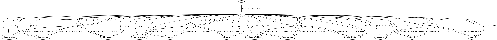

# TOC Project 2020

## ROBOT : Tech BOT

## Finite State Machine 
 
### Usage 

#### The robot has mainly 4 states. 

1st State : User State (Sent the message to know about the usage of the robot)

2nd State : Choosing the service in Help Center (Including 4 substates in the button template)

3rd State : Choosing the brand (Including 3~4 substates in the state choosing before)

4th State : Get the website's link\n

